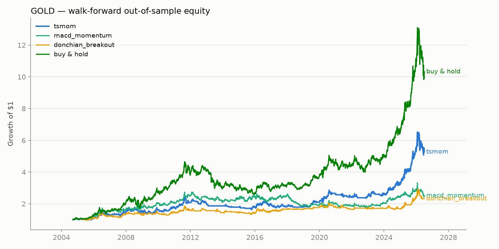
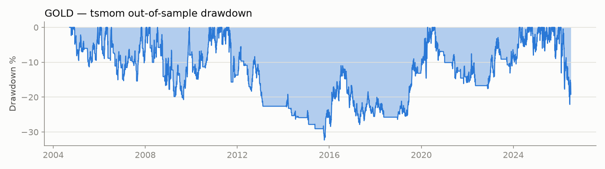
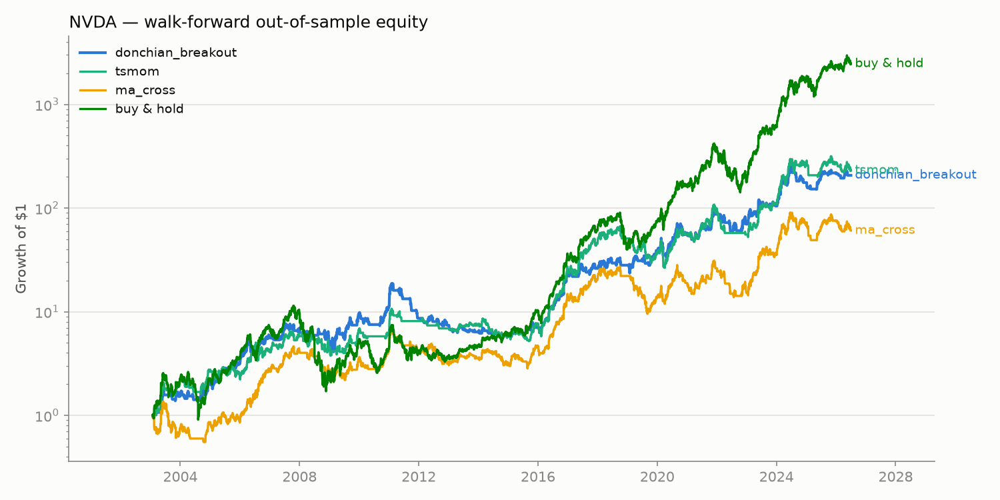
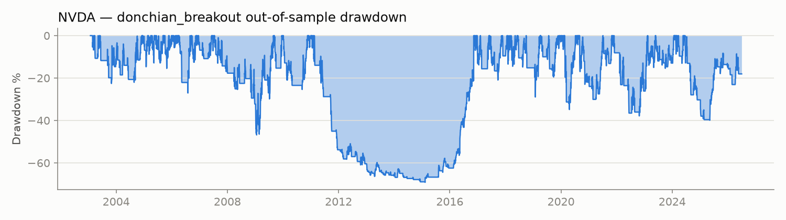
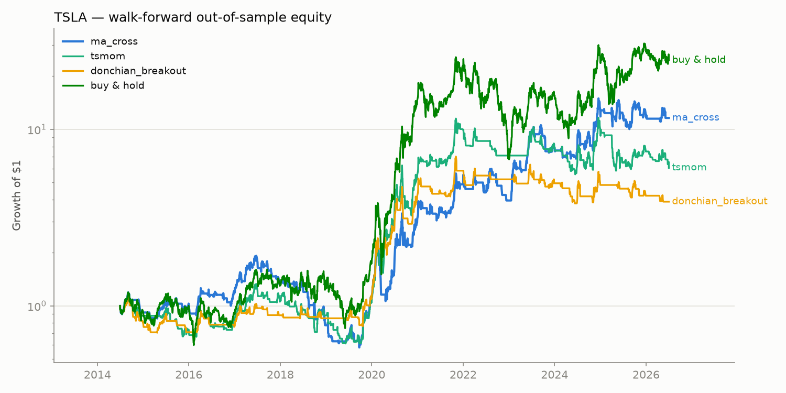
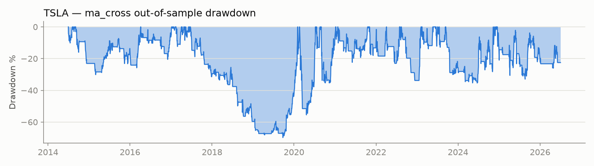

# Backtest Report — Short-Term Trading Signals

Generated 2026-07-04 10:33 UTC. Execution: signals at the close, positions earn the next bar's close-to-close return, 10 bps cost per unit turnover. Strategy selection is by walk-forward out-of-sample Sharpe, never in-sample fit.

**This is research output, not financial advice.** Past performance does not guarantee future results.

## GOLD

Data: **2000-08-30 → 2026-07-03** (6,484 bars, 25.7 years). Buy & hold: 1,429% total, CAGR 11.2%, Sharpe 0.68, max drawdown -44%.

### Walk-forward (out-of-sample) results

Rolling 4-year train → 1-year test, parameters re-fit each year on the train window only. These numbers are on unseen data.

| Strategy | total return | cagr | sharpe | sortino | max drawdown | win rate | profit factor | n trades | avg bars held | exposure |
|---|---|---|---|---|---|---|---|---|---|---|
| **tsmom** | 426.9% | 7.9% | 0.60 | 0.64 | -32.3% | 41.8% | 2.23 | 158 | 22.42 | 64.7% |
| macd_momentum | 151.4% | 4.3% | 0.38 | 0.41 | -35.3% | 47.8% | 1.40 | 339 | 9.85 | 61.0% |
| donchian_breakout | 131.9% | 3.9% | 0.37 | 0.32 | -28.9% | 45.5% | 1.52 | 123 | 20.87 | 46.9% |
| ma_cross | 111.7% | 3.5% | 0.31 | 0.33 | -48.5% | 41.7% | 2.06 | 108 | 33.91 | 66.9% |
| double_low | 61.8% | 2.2% | 0.30 | 0.20 | -28.6% | 66.9% | 1.62 | 154 | 8.16 | 22.9% |
| rsi_reversion | 28.7% | 1.2% | 0.20 | 0.09 | -16.7% | 68.2% | 1.71 | 85 | 7.31 | 11.3% |
| bollinger_reversion | 18.9% | 0.8% | 0.17 | 0.06 | -16.5% | 66.2% | 1.59 | 71 | 7.30 | 9.5% |
| buy & hold (same period) | 931.9% | 11.3% | 0.68 | 0.89 | -44.4% | 100.0% | — | 1 | 5,475.00 | 100.0% |

### In-sample best fits (reference — overfit by construction)

| Strategy | total return | cagr | sharpe | sortino | max drawdown | win rate | profit factor | n trades | avg bars held | exposure |
|---|---|---|---|---|---|---|---|---|---|---|
| tsmom {'lookback': 120, 'trend_n': 0, 'allow_short': False} | 664.5% | 8.2% | 0.61 | 0.67 | -33.0% | 41.2% | 4.37 | 102 | 44.29 | 69.7% |
| ma_cross {'fast': 5, 'slow': 50, 'use_ema': False, 'allow_short': False} | 355.3% | 6.1% | 0.50 | 0.50 | -36.2% | 44.3% | 2.49 | 115 | 32.63 | 57.9% |
| macd_momentum {'fast': 8, 'slow': 17, 'signal': 9, 'allow_short': False} | 290.0% | 5.4% | 0.48 | 0.49 | -22.9% | 42.8% | 1.76 | 311 | 10.82 | 51.9% |
| rsi_reversion {'rsi_n': 3, 'entry': 10, 'exit_level': 70, 'trend_n': 200} | 73.2% | 2.2% | 0.47 | 0.18 | -11.2% | 74.1% | 3.52 | 54 | 7.57 | 6.3% |
| donchian_breakout {'entry_n': 20, 'exit_n': 20, 'allow_short': False} | 248.9% | 5.0% | 0.42 | 0.42 | -35.2% | 47.6% | 2.27 | 82 | 45.44 | 57.5% |
| double_low {'n': 10, 'trend_n': 200} | 129.2% | 3.3% | 0.40 | 0.28 | -24.6% | 66.5% | 1.93 | 158 | 9.97 | 24.3% |
| bollinger_reversion {'n': 20, 'k': 2.0, 'trend_n': 200} | 57.0% | 1.8% | 0.37 | 0.14 | -19.5% | 69.1% | 2.55 | 55 | 10.40 | 8.8% |

### Selected for live signals: `tsmom`

- Out-of-sample: Sharpe **0.60**, CAGR 7.9%, max DD -32.3%, 158 trades, win rate 42%.
- Live parameters (re-fit on the last 4 years): `{'lookback': 60, 'trend_n': 0, 'allow_short': False}`
- Walk-forward parameter history: most recent folds [{'lookback': 60, 'trend_n': 0, 'allow_short': False}, {'lookback': 120, 'trend_n': 0, 'allow_short': False}, {'lookback': 120, 'trend_n': 0, 'allow_short': True}]

## NVDA

Data: **1999-01-22 → 2026-07-02** (6,903 bars, 27.4 years). Buy & hold: 518,631% total, CAGR 36.7%, Sharpe 0.82, max drawdown -90%.

### Walk-forward (out-of-sample) results

Rolling 4-year train → 1-year test, parameters re-fit each year on the train window only. These numbers are on unseen data.

| Strategy | total return | cagr | sharpe | sortino | max drawdown | win rate | profit factor | n trades | avg bars held | exposure |
|---|---|---|---|---|---|---|---|---|---|---|
| **donchian_breakout** | 20,585.9% | 25.6% | 0.83 | 1.00 | -69.2% | 46.1% | 3.17 | 115 | 28.65 | 55.9% |
| tsmom | 22,929.3% | 26.2% | 0.81 | 1.02 | -60.2% | 41.9% | 3.18 | 241 | 16.62 | 68.0% |
| ma_cross | 5,965.6% | 19.2% | 0.64 | 0.83 | -65.0% | 44.0% | 2.69 | 134 | 33.10 | 75.3% |
| double_low | 522.1% | 8.1% | 0.44 | 0.34 | -52.0% | 65.6% | 1.67 | 241 | 6.04 | 24.7% |
| macd_momentum | 584.8% | 8.6% | 0.41 | 0.43 | -79.0% | 44.5% | 1.47 | 371 | 8.88 | 55.9% |
| rsi_reversion | 49.7% | 1.7% | 0.18 | 0.11 | -65.7% | 66.7% | 1.57 | 135 | 6.61 | 15.1% |
| bollinger_reversion | 39.9% | 1.4% | 0.17 | 0.07 | -53.6% | 64.1% | 1.63 | 92 | 6.48 | 10.1% |
| buy & hold (same period) | 245,866.4% | 39.6% | 0.92 | 1.31 | -85.1% | 100.0% | — | 1 | 5,894.00 | 100.0% |

### In-sample best fits (reference — overfit by construction)

| Strategy | total return | cagr | sharpe | sortino | max drawdown | win rate | profit factor | n trades | avg bars held | exposure |
|---|---|---|---|---|---|---|---|---|---|---|
| tsmom {'lookback': 20, 'trend_n': 0, 'allow_short': False} | 502,237.3% | 36.5% | 0.95 | 1.18 | -68.1% | 44.0% | 2.84 | 307 | 13.22 | 58.8% |
| ma_cross {'fast': 5, 'slow': 50, 'use_ema': True, 'allow_short': False} | 204,671.5% | 32.1% | 0.86 | 1.09 | -75.8% | 33.1% | 3.79 | 121 | 36.81 | 64.5% |
| donchian_breakout {'entry_n': 20, 'exit_n': 20, 'allow_short': False} | 124,898.9% | 29.7% | 0.82 | 1.00 | -69.0% | 55.8% | 3.92 | 77 | 54.10 | 60.4% |
| macd_momentum {'fast': 5, 'slow': 35, 'signal': 5, 'allow_short': False} | 28,533.0% | 22.9% | 0.70 | 0.74 | -67.0% | 43.3% | 1.80 | 446 | 7.84 | 50.7% |
| double_low {'n': 10, 'trend_n': 200} | 2,225.1% | 12.2% | 0.55 | 0.43 | -72.3% | 73.0% | 2.03 | 174 | 9.30 | 23.5% |
| rsi_reversion {'rsi_n': 3, 'entry': 15, 'exit_level': 80, 'trend_n': 200} | 1,134.6% | 9.6% | 0.52 | 0.33 | -70.7% | 71.7% | 2.24 | 99 | 10.64 | 15.3% |
| bollinger_reversion {'n': 10, 'k': 1.5, 'trend_n': 200} | 646.7% | 7.6% | 0.43 | 0.29 | -58.3% | 69.7% | 1.82 | 175 | 6.05 | 15.3% |

### Selected for live signals: `donchian_breakout`

- Out-of-sample: Sharpe **0.83**, CAGR 25.6%, max DD -69.2%, 115 trades, win rate 46%.
- Live parameters (re-fit on the last 4 years): `{'entry_n': 10, 'exit_n': 5, 'allow_short': False}`
- Walk-forward parameter history: most recent folds [{'entry_n': 20, 'exit_n': 10, 'allow_short': False}, {'entry_n': 10, 'exit_n': 5, 'allow_short': False}, {'entry_n': 10, 'exit_n': 5, 'allow_short': False}]

## TSLA

Data: **2010-06-29 → 2026-07-02** (4,027 bars, 16.0 years). Buy & hold: 24,604% total, CAGR 41.2%, Sharpe 0.89, max drawdown -74%.

### Walk-forward (out-of-sample) results

Rolling 4-year train → 1-year test, parameters re-fit each year on the train window only. These numbers are on unseen data.

| Strategy | total return | cagr | sharpe | sortino | max drawdown | win rate | profit factor | n trades | avg bars held | exposure |
|---|---|---|---|---|---|---|---|---|---|---|
| **ma_cross** | 1,060.4% | 22.7% | 0.70 | 0.74 | -69.8% | 40.7% | 2.19 | 81 | 20.48 | 55.0% |
| tsmom | 505.4% | 16.2% | 0.58 | 0.59 | -54.1% | 43.7% | 2.27 | 151 | 10.08 | 50.4% |
| donchian_breakout | 289.2% | 12.0% | 0.52 | 0.43 | -45.8% | 39.0% | 2.03 | 59 | 16.15 | 31.6% |
| macd_momentum | 384.1% | 14.1% | 0.52 | 0.60 | -66.6% | 40.4% | 1.39 | 183 | 9.04 | 54.9% |
| bollinger_reversion | -31.4% | -3.1% | -0.06 | -0.03 | -58.4% | 54.7% | 0.95 | 53 | 5.58 | 9.8% |
| double_low | -54.8% | -6.4% | -0.09 | -0.06 | -68.3% | 57.4% | 1.10 | 122 | 5.23 | 21.1% |
| rsi_reversion | -54.4% | -6.3% | -0.24 | -0.10 | -65.1% | 54.1% | 0.70 | 61 | 5.51 | 11.1% |
| buy & hold (same period) | 2,361.9% | 30.7% | 0.75 | 1.11 | -73.6% | 100.0% | — | 1 | 3,018.00 | 100.0% |

### In-sample best fits (reference — overfit by construction)

| Strategy | total return | cagr | sharpe | sortino | max drawdown | win rate | profit factor | n trades | avg bars held | exposure |
|---|---|---|---|---|---|---|---|---|---|---|
| ma_cross {'fast': 10, 'slow': 20, 'use_ema': False, 'allow_short': False} | 34,450.6% | 44.2% | 1.08 | 1.26 | -68.1% | 43.1% | 3.68 | 109 | 20.52 | 55.6% |
| macd_momentum {'fast': 12, 'slow': 35, 'signal': 9, 'allow_short': False} | 9,717.6% | 33.2% | 0.90 | 1.07 | -58.1% | 37.2% | 2.46 | 148 | 14.17 | 52.1% |
| tsmom {'lookback': 20, 'trend_n': 0, 'allow_short': False} | 7,662.9% | 31.3% | 0.86 | 0.98 | -68.0% | 35.1% | 2.63 | 188 | 11.89 | 55.5% |
| donchian_breakout {'entry_n': 20, 'exit_n': 5, 'allow_short': False} | 3,062.7% | 24.1% | 0.83 | 0.75 | -55.2% | 48.1% | 2.89 | 79 | 16.91 | 33.2% |
| rsi_reversion {'rsi_n': 2, 'entry': 5, 'exit_level': 60, 'trend_n': 200} | 76.2% | 3.6% | 0.30 | 0.11 | -44.1% | 73.1% | 1.93 | 52 | 3.56 | 4.6% |
| bollinger_reversion {'n': 10, 'k': 2.0, 'trend_n': 200} | 29.0% | 1.6% | 0.18 | 0.08 | -67.1% | 63.2% | 1.41 | 57 | 6.51 | 9.2% |
| double_low {'n': 5, 'trend_n': 100} | 1.5% | 0.1% | 0.14 | 0.09 | -69.3% | 63.3% | 1.20 | 177 | 4.60 | 20.2% |

### Selected for live signals: `ma_cross`

- Out-of-sample: Sharpe **0.70**, CAGR 22.7%, max DD -69.8%, 81 trades, win rate 41%.
- Live parameters (re-fit on the last 4 years): `{'fast': 10, 'slow': 20, 'use_ema': False, 'allow_short': False}`
- Walk-forward parameter history: most recent folds [{'fast': 10, 'slow': 20, 'use_ema': False, 'allow_short': False}, {'fast': 10, 'slow': 20, 'use_ema': False, 'allow_short': False}, {'fast': 10, 'slow': 20, 'use_ema': False, 'allow_short': False}]

