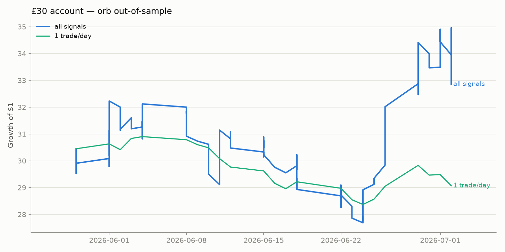
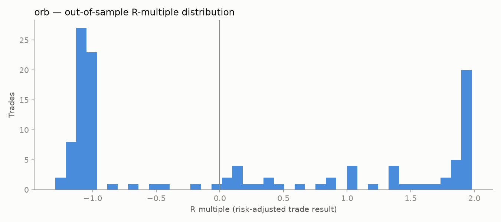

# Day-Trading Backtest Report

Generated 2026-07-04 10:46 UTC.

Universe: **59 liquid US stocks/ETFs**, 5-minute bars, **60 sessions** (2026-04-08 → 2026-07-02). Every trade is a **2:1 reward:risk bracket** (target = 2× stop distance), flat by 15:55 ET, 6 bps round-trip costs, conservative fills (stop always assumed to hit before target inside a bar).

Train = first 60% of sessions, **test = last 40% (out-of-sample, from 2026-05-29)**. Selection gates: ≥60 train trades, win rate ≥40% in BOTH train and test, positive expectancy.

**Research output, not financial advice.**

## Training-period results (all configurations)

| config | n trades | win rate | target rate | stop rate | eod rate | expectancy r | profit factor | avg risk pct | trades per day |
|---|---|---|---|---|---|---|---|---|---|
| `gap_go` {'gap_min': 0.015, 'allow_short': False} | 165 | 52.7% | 7.3% | 21.8% | 70.9% | 0.10 | 1.30 | 2.3% | 5.16 |
| `orb` {'range_mins': 30, 'stop_mode': 'range', 'allow_short': False, 'rvol_min': 0.0} | 1248 | 50.6% | 6.3% | 18.3% | 75.3% | 0.06 | 1.20 | 1.8% | 34.67 |
| `orb` {'range_mins': 30, 'stop_mode': 'range', 'allow_short': False, 'rvol_min': 1.5} | 128 | 52.3% | 3.9% | 10.2% | 85.9% | 0.06 | 1.24 | 2.8% | 4.00 |
| `orb` {'range_mins': 15, 'stop_mode': 'range', 'allow_short': False, 'rvol_min': 0.0} | 1403 | 48.4% | 11.8% | 29.2% | 59.0% | 0.05 | 1.13 | 1.5% | 38.97 |
| `orb` {'range_mins': 15, 'stop_mode': 'half', 'allow_short': False, 'rvol_min': 1.5} | 159 | 44.7% | 23.9% | 49.1% | 27.0% | 0.05 | 1.09 | 1.1% | 4.68 |
| `orb` {'range_mins': 60, 'stop_mode': 'half', 'allow_short': False, 'rvol_min': 1.5} | 110 | 48.2% | 12.7% | 29.1% | 58.2% | 0.05 | 1.12 | 1.5% | 3.79 |
| `gap_go` {'gap_min': 0.025, 'allow_short': False} | 84 | 56.0% | 4.8% | 27.4% | 67.9% | 0.05 | 1.14 | 2.7% | 4.20 |
| `orb` {'range_mins': 60, 'stop_mode': 'range', 'allow_short': False, 'rvol_min': 0.0} | 1051 | 50.9% | 2.1% | 10.3% | 87.6% | 0.04 | 1.18 | 2.1% | 29.19 |
| `gap_go` {'gap_min': 0.04, 'allow_short': False} | 32 | 62.5% | 3.1% | 25.0% | 71.9% | 0.04 | 1.14 | 3.3% | 1.88 |
| `orb` {'range_mins': 60, 'stop_mode': 'half', 'allow_short': False, 'rvol_min': 0.0} | 1051 | 46.7% | 14.3% | 34.0% | 51.8% | 0.04 | 1.08 | 1.1% | 29.19 |
| `orb` {'range_mins': 60, 'stop_mode': 'range', 'allow_short': False, 'rvol_min': 1.5} | 110 | 52.7% | 0.0% | 7.3% | 92.7% | 0.03 | 1.13 | 3.0% | 3.79 |
| `orb` {'range_mins': 15, 'stop_mode': 'range', 'allow_short': False, 'rvol_min': 1.5} | 159 | 50.9% | 3.8% | 21.4% | 74.8% | 0.01 | 1.03 | 2.2% | 4.68 |
| `gap_go` {'gap_min': 0.04, 'allow_short': True} | 50 | 58.0% | 2.0% | 24.0% | 74.0% | -0.00 | 0.98 | 3.3% | 2.27 |
| `orb` {'range_mins': 30, 'stop_mode': 'half', 'allow_short': False, 'rvol_min': 1.5} | 128 | 45.3% | 14.8% | 43.0% | 42.2% | -0.02 | 0.97 | 1.4% | 4.00 |
| `orb` {'range_mins': 15, 'stop_mode': 'range', 'allow_short': True, 'rvol_min': 1.5} | 285 | 46.7% | 4.6% | 23.2% | 72.3% | -0.02 | 0.94 | 2.4% | 7.92 |
| `orb` {'range_mins': 30, 'stop_mode': 'range', 'allow_short': True, 'rvol_min': 1.5} | 257 | 45.9% | 2.7% | 12.1% | 85.2% | -0.03 | 0.91 | 2.9% | 7.14 |
| `orb` {'range_mins': 60, 'stop_mode': 'range', 'allow_short': True, 'rvol_min': 0.0} | 1787 | 46.7% | 1.8% | 11.3% | 86.9% | -0.03 | 0.90 | 2.2% | 49.64 |
| `orb` {'range_mins': 15, 'stop_mode': 'half', 'allow_short': True, 'rvol_min': 1.5} | 285 | 40.4% | 22.8% | 48.1% | 29.1% | -0.03 | 0.95 | 1.2% | 7.92 |
| `orb` {'range_mins': 30, 'stop_mode': 'range', 'allow_short': True, 'rvol_min': 0.0} | 2001 | 46.6% | 4.9% | 20.7% | 74.4% | -0.03 | 0.91 | 1.9% | 55.58 |
| `gap_go` {'gap_min': 0.015, 'allow_short': True} | 304 | 45.7% | 7.6% | 28.6% | 63.8% | -0.03 | 0.92 | 2.3% | 8.69 |
| `orb` {'range_mins': 60, 'stop_mode': 'half', 'allow_short': True, 'rvol_min': 0.0} | 1787 | 43.9% | 13.2% | 35.0% | 51.8% | -0.03 | 0.93 | 1.1% | 49.64 |
| `orb` {'range_mins': 30, 'stop_mode': 'half', 'allow_short': False, 'rvol_min': 0.0} | 1248 | 41.9% | 20.4% | 47.8% | 31.8% | -0.04 | 0.93 | 0.9% | 34.67 |
| `vwap_pullback` {'confirm_mins': 30, 'stop_atr': 1.5, 'allow_short': False} | 992 | 39.7% | 24.7% | 53.6% | 21.7% | -0.06 | 0.91 | 0.7% | 27.56 |
| `orb` {'range_mins': 30, 'stop_mode': 'half', 'allow_short': True, 'rvol_min': 1.5} | 257 | 42.4% | 16.3% | 42.4% | 41.2% | -0.06 | 0.89 | 1.5% | 7.14 |
| `orb` {'range_mins': 60, 'stop_mode': 'range', 'allow_short': True, 'rvol_min': 1.5} | 227 | 45.4% | 0.0% | 7.0% | 93.0% | -0.06 | 0.75 | 3.3% | 6.49 |
| `orb` {'range_mins': 60, 'stop_mode': 'half', 'allow_short': True, 'rvol_min': 1.5} | 227 | 43.6% | 11.0% | 30.8% | 58.1% | -0.06 | 0.86 | 1.6% | 6.49 |
| `orb` {'range_mins': 15, 'stop_mode': 'range', 'allow_short': True, 'rvol_min': 0.0} | 2086 | 43.9% | 9.1% | 33.2% | 57.7% | -0.07 | 0.85 | 1.6% | 57.94 |
| `gap_go` {'gap_min': 0.025, 'allow_short': True} | 151 | 47.7% | 4.6% | 32.5% | 62.9% | -0.08 | 0.80 | 2.7% | 5.03 |
| `orb` {'range_mins': 30, 'stop_mode': 'half', 'allow_short': True, 'rvol_min': 0.0} | 2001 | 39.4% | 18.7% | 49.7% | 31.6% | -0.11 | 0.81 | 1.0% | 55.58 |
| `vwap_pullback` {'confirm_mins': 30, 'stop_atr': 1.0, 'allow_short': False} | 992 | 36.2% | 33.2% | 62.1% | 4.7% | -0.12 | 0.84 | 0.5% | 27.56 |
| `vwap_pullback` {'confirm_mins': 30, 'stop_atr': 1.5, 'allow_short': True} | 1910 | 37.3% | 22.0% | 56.6% | 21.4% | -0.14 | 0.78 | 0.8% | 53.06 |
| `orb` {'range_mins': 15, 'stop_mode': 'half', 'allow_short': False, 'rvol_min': 0.0} | 1403 | 36.4% | 23.7% | 57.9% | 18.3% | -0.15 | 0.78 | 0.8% | 38.97 |
| `vwap_pullback` {'confirm_mins': 60, 'stop_atr': 1.5, 'allow_short': False} | 918 | 35.7% | 24.2% | 58.6% | 17.2% | -0.17 | 0.75 | 0.6% | 25.50 |
| `vwap_pullback` {'confirm_mins': 30, 'stop_atr': 1.0, 'allow_short': True} | 1910 | 33.9% | 30.5% | 64.7% | 4.8% | -0.19 | 0.75 | 0.5% | 53.06 |
| `vwap_pullback` {'confirm_mins': 60, 'stop_atr': 1.0, 'allow_short': False} | 918 | 33.9% | 32.0% | 65.0% | 2.9% | -0.22 | 0.73 | 0.4% | 25.50 |
| `vwap_pullback` {'confirm_mins': 60, 'stop_atr': 1.5, 'allow_short': True} | 1739 | 33.7% | 22.9% | 60.6% | 16.6% | -0.23 | 0.68 | 0.6% | 48.31 |
| `orb` {'range_mins': 15, 'stop_mode': 'half', 'allow_short': True, 'rvol_min': 0.0} | 2086 | 32.8% | 21.2% | 61.7% | 17.0% | -0.25 | 0.66 | 0.8% | 57.94 |
| `vwap_pullback` {'confirm_mins': 60, 'stop_atr': 1.0, 'allow_short': True} | 1739 | 32.7% | 30.4% | 66.3% | 3.3% | -0.26 | 0.68 | 0.4% | 48.31 |

## Out-of-sample results (train-qualified configurations only)

11 of 38 configurations passed the training gates (≥60 trades, win rate ≥40%, positive expectancy).

| config | n trades | win rate | target rate | stop rate | eod rate | expectancy r | profit factor | avg risk pct | trades per day |
|---|---|---|---|---|---|---|---|---|---|
| `orb` {'range_mins': 15, 'stop_mode': 'half', 'allow_short': False, 'rvol_min': 1.5} | 121 | 45.5% | 24.8% | 49.6% | 25.6% | 0.06 | 1.11 | 1.2% | 5.26 |
| `orb` {'range_mins': 60, 'stop_mode': 'range', 'allow_short': False, 'rvol_min': 1.5} | 71 | 49.3% | 1.4% | 1.4% | 97.2% | 0.05 | 1.28 | 3.5% | 3.55 |
| `orb` {'range_mins': 60, 'stop_mode': 'half', 'allow_short': False, 'rvol_min': 1.5} | 71 | 46.5% | 9.9% | 28.2% | 62.0% | 0.02 | 1.05 | 1.7% | 3.55 |
| `orb` {'range_mins': 15, 'stop_mode': 'range', 'allow_short': False, 'rvol_min': 1.5} | 121 | 47.9% | 8.3% | 25.6% | 66.1% | -0.01 | 0.99 | 2.5% | 5.26 |
| `orb` {'range_mins': 30, 'stop_mode': 'range', 'allow_short': False, 'rvol_min': 1.5} | 94 | 45.7% | 2.1% | 12.8% | 85.1% | -0.02 | 0.93 | 3.1% | 4.27 |
| `orb` {'range_mins': 60, 'stop_mode': 'range', 'allow_short': False, 'rvol_min': 0.0} | 632 | 43.0% | 2.5% | 13.3% | 84.2% | -0.10 | 0.68 | 2.4% | 26.33 |
| `orb` {'range_mins': 30, 'stop_mode': 'range', 'allow_short': False, 'rvol_min': 0.0} | 805 | 39.0% | 4.1% | 28.4% | 67.5% | -0.19 | 0.57 | 2.1% | 33.54 |
| `gap_go` {'gap_min': 0.015, 'allow_short': False} | 133 | 38.3% | 6.0% | 35.3% | 58.6% | -0.19 | 0.59 | 2.4% | 6.05 |
| `orb` {'range_mins': 15, 'stop_mode': 'range', 'allow_short': False, 'rvol_min': 0.0} | 962 | 36.9% | 8.4% | 38.8% | 52.8% | -0.20 | 0.61 | 1.8% | 40.08 |
| `orb` {'range_mins': 60, 'stop_mode': 'half', 'allow_short': False, 'rvol_min': 0.0} | 632 | 38.0% | 10.3% | 44.3% | 45.4% | -0.21 | 0.63 | 1.2% | 26.33 |
| `gap_go` {'gap_min': 0.025, 'allow_short': False} | 63 | 36.5% | 4.8% | 33.3% | 61.9% | -0.26 | 0.46 | 2.8% | 4.20 |

## Selected configuration: `orb` {'range_mins': 15, 'stop_mode': 'half', 'allow_short': False, 'rvol_min': 1.5}

- Out-of-sample: **121 trades**, win rate **45.5%** (target hit 25%, stopped 50%, closed EOD 26%), expectancy **+0.06R** per trade, profit factor 1.11.

### Best / worst symbols out-of-sample (total R)

| symbol | trades | avg R | total R |
|---|---|---|---|
| XLF | 2 | +1.82 | +3.6 |
| NVDA | 2 | +1.61 | +3.2 |
| NKE | 3 | +1.04 | +3.1 |
| MSTR | 7 | +0.42 | +2.9 |
| AVGO | 2 | +1.22 | +2.4 |
| BABA | 2 | +1.19 | +2.4 |
| DIS | 3 | +0.74 | +2.2 |
| AMZN | 3 | +0.74 | +2.2 |
| AAPL | 2 | -1.07 | -2.1 |
| QQQ | 2 | -1.15 | -2.3 |
| SPY | 2 | -1.24 | -2.5 |
| GLD | 3 | -1.17 | -3.5 |
| HOOD | 6 | -0.84 | -5.0 |

### £30 account simulation (out-of-sample, risking 1.5% per trade, no leverage)

- Taking **every** signal (121 trades): £30.00 → **£32.85** (+9.5%)
- Taking the **first signal each day** (single-position account): £30.00 → **£29.07** (-3.1%)

Note: with ~0.5% typical stop distance, 1.5% account risk wants ~3× the account in position size; the no-leverage cap means realized risk per trade is often below 1.5%. Fractional shares required at this account size.

