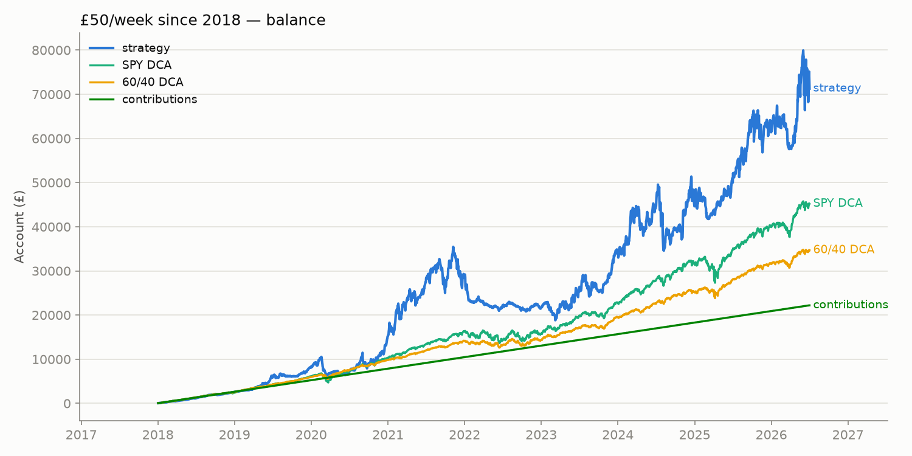
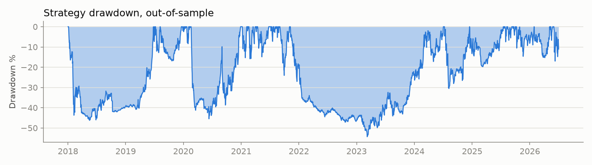
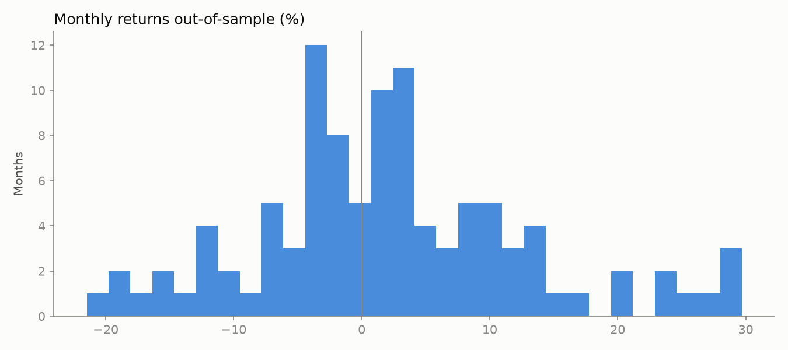

# Wealth-Builder Backtest — Momentum Rotation with £50/week

Generated 2026-07-04 11:05 UTC. Data through **2026-07-02**.

Every configuration decides weights on the rebalance close and trades the next day, 10 bps turnover costs, £50 contributed every Monday. Configs are ranked **on the training period only** (→ 2017), then judged on unseen data (**2018-01-01 → today**: covers the 2018 correction, the 2020 crash, the 2022 bear market and the 2024-26 bull run). USD returns; GBP/USD ignored.

**Research output, not financial advice.**

## Top 10 by raw TRAINING CAGR — and how they did out-of-sample (the overfitting exhibit)

### Training period

| config | cagr | sharpe | max drawdown | avg month | pct positive months | worst month | final balance | profit |
|---|---|---|---|---|---|---|---|---|
| `aggressive` lb=blend n=1 trend=N def=IEF reb=M | 119.6% | 1.73 | -35.5% | 8.0% | 67.1% | -22.7% | £1,560,853 | £1,543,653 |
| `aggressive` lb=blend n=1 trend=N def=best_def reb=M | 119.6% | 1.73 | -35.5% | 8.0% | 67.1% | -22.7% | £1,560,853 | £1,543,653 |
| `aggressive` lb=126 n=1 trend=Y def=IEF reb=M | 114.7% | 1.72 | -35.5% | 7.8% | 68.4% | -20.4% | £1,240,674 | £1,223,474 |
| `aggressive` lb=126 n=1 trend=Y def=best_def reb=M | 113.4% | 1.70 | -35.5% | 7.8% | 68.4% | -20.4% | £1,197,481 | £1,180,281 |
| `aggressive` lb=blend n=1 trend=Y def=IEF reb=M | 111.6% | 1.67 | -35.5% | 7.7% | 65.8% | -22.7% | £1,339,425 | £1,322,225 |
| `aggressive` lb=blend n=1 trend=Y def=best_def reb=M | 111.6% | 1.67 | -35.5% | 7.7% | 65.8% | -22.7% | £1,339,425 | £1,322,225 |
| `aggressive` lb=126 n=1 trend=N def=IEF reb=W | 111.3% | 1.68 | -41.0% | 7.8% | 68.4% | -34.0% | £1,100,253 | £1,083,053 |
| `aggressive` lb=126 n=1 trend=N def=best_def reb=W | 111.3% | 1.68 | -41.0% | 7.8% | 68.4% | -34.0% | £1,100,253 | £1,083,053 |
| `aggressive` lb=126 n=1 trend=Y def=IEF reb=W | 109.8% | 1.67 | -37.6% | 7.7% | 69.6% | -33.8% | £1,082,896 | £1,065,696 |
| `aggressive` lb=126 n=1 trend=Y def=best_def reb=W | 109.4% | 1.66 | -37.8% | 7.6% | 69.6% | -33.8% | £1,069,878 | £1,052,678 |

### The same 10, out-of-sample (2018 → today)

| config | cagr | sharpe | max drawdown | avg month | pct positive months | worst month | final balance | profit |
|---|---|---|---|---|---|---|---|---|
| `aggressive` lb=blend n=1 trend=N def=IEF reb=M | 2.0% | 0.34 | -88.1% | 1.7% | 47.6% | -50.4% | £58,911 | £36,711 |
| `aggressive` lb=blend n=1 trend=N def=best_def reb=M | 2.0% | 0.34 | -88.1% | 1.7% | 47.6% | -50.4% | £58,911 | £36,711 |
| `aggressive` lb=126 n=1 trend=Y def=IEF reb=M | -7.5% | 0.14 | -84.6% | 0.6% | 47.6% | -38.6% | £35,817 | £13,617 |
| `aggressive` lb=126 n=1 trend=Y def=best_def reb=M | -7.5% | 0.14 | -84.7% | 0.6% | 47.6% | -38.2% | £35,851 | £13,651 |
| `aggressive` lb=blend n=1 trend=Y def=IEF reb=M | 1.4% | 0.31 | -79.8% | 1.5% | 48.5% | -38.6% | £50,468 | £28,268 |
| `aggressive` lb=blend n=1 trend=Y def=best_def reb=M | 2.0% | 0.32 | -80.1% | 1.6% | 47.6% | -38.2% | £52,696 | £30,496 |
| `aggressive` lb=126 n=1 trend=N def=IEF reb=W | -4.7% | 0.20 | -80.1% | 0.8% | 47.6% | -38.2% | £33,498 | £11,298 |
| `aggressive` lb=126 n=1 trend=N def=best_def reb=W | -4.7% | 0.20 | -80.1% | 0.8% | 47.6% | -38.2% | £33,498 | £11,298 |
| `aggressive` lb=126 n=1 trend=Y def=IEF reb=W | -2.6% | 0.23 | -78.2% | 1.0% | 49.5% | -38.2% | £36,459 | £14,259 |
| `aggressive` lb=126 n=1 trend=Y def=best_def reb=W | -2.6% | 0.23 | -78.4% | 1.0% | 47.6% | -38.2% | £36,596 | £14,396 |

## Top 10 by TRAINING Calmar (the ex-ante selection rule)

### Training period

| config | cagr | sharpe | max drawdown | avg month | pct positive months | worst month | final balance | profit |
|---|---|---|---|---|---|---|---|---|
| `aggressive` lb=63 n=2 trend=Y def=IEF reb=M | 50.9% | 1.44 | -21.2% | 3.9% | 55.7% | -12.1% | £153,455 | £136,255 |
| `aggressive` lb=blend n=2 trend=Y def=best_def reb=M | 61.8% | 1.51 | -26.5% | 4.6% | 64.6% | -17.0% | £272,467 | £255,267 |
| `aggressive` lb=126 n=2 trend=Y def=IEF reb=M | 67.7% | 1.64 | -29.6% | 4.9% | 64.6% | -18.9% | £295,622 | £278,422 |
| `aggressive` lb=126 n=2 trend=N def=IEF reb=M | 70.4% | 1.66 | -31.2% | 5.1% | 67.1% | -26.8% | £276,278 | £259,078 |
| `aggressive` lb=126 n=2 trend=N def=best_def reb=M | 70.4% | 1.66 | -31.2% | 5.1% | 67.1% | -26.8% | £276,278 | £259,078 |
| `aggressive` lb=126 n=2 trend=Y def=best_def reb=M | 66.3% | 1.60 | -29.6% | 4.9% | 64.6% | -18.9% | £286,464 | £269,264 |
| `aggressive` lb=blend n=2 trend=Y def=IEF reb=M | 61.4% | 1.51 | -27.9% | 4.6% | 64.6% | -17.0% | £272,529 | £255,329 |
| `aggressive` lb=126 n=2 trend=N def=IEF reb=W | 66.6% | 1.59 | -31.0% | 5.0% | 64.6% | -27.3% | £280,127 | £262,927 |
| `aggressive` lb=126 n=2 trend=N def=best_def reb=W | 66.6% | 1.59 | -31.0% | 5.0% | 64.6% | -27.3% | £280,127 | £262,927 |
| `aggressive` lb=126 n=3 trend=N def=IEF reb=M | 55.7% | 1.59 | -26.1% | 4.1% | 68.4% | -19.3% | £173,236 | £156,036 |

### The same 10, out-of-sample (2018 → today)

| config | cagr | sharpe | max drawdown | avg month | pct positive months | worst month | final balance | profit |
|---|---|---|---|---|---|---|---|---|
| `aggressive` lb=63 n=2 trend=Y def=IEF reb=M | 21.0% | 0.71 | -54.3% | 2.1% | 55.3% | -21.5% | £71,282 | £49,082 |
| `aggressive` lb=blend n=2 trend=Y def=best_def reb=M | 16.0% | 0.57 | -62.6% | 2.0% | 51.5% | -30.2% | £78,423 | £56,223 |
| `aggressive` lb=126 n=2 trend=Y def=IEF reb=M | 5.7% | 0.34 | -70.4% | 1.2% | 51.5% | -30.4% | £50,614 | £28,414 |
| `aggressive` lb=126 n=2 trend=N def=IEF reb=M | 12.0% | 0.48 | -59.4% | 1.6% | 57.3% | -26.0% | £58,951 | £36,751 |
| `aggressive` lb=126 n=2 trend=N def=best_def reb=M | 12.0% | 0.48 | -59.4% | 1.6% | 57.3% | -26.0% | £58,951 | £36,751 |
| `aggressive` lb=126 n=2 trend=Y def=best_def reb=M | 5.8% | 0.34 | -71.7% | 1.2% | 50.5% | -30.2% | £52,300 | £30,100 |
| `aggressive` lb=blend n=2 trend=Y def=IEF reb=M | 16.3% | 0.58 | -59.7% | 2.0% | 52.4% | -30.4% | £75,674 | £53,474 |
| `aggressive` lb=126 n=2 trend=N def=IEF reb=W | 10.8% | 0.46 | -63.5% | 1.5% | 57.3% | -27.0% | £54,645 | £32,445 |
| `aggressive` lb=126 n=2 trend=N def=best_def reb=W | 10.8% | 0.46 | -63.5% | 1.5% | 57.3% | -27.0% | £54,645 | £32,445 |
| `aggressive` lb=126 n=3 trend=N def=IEF reb=M | 17.3% | 0.61 | -53.4% | 1.9% | 58.3% | -26.2% | £66,682 | £44,482 |

### Benchmarks, out-of-sample (same £50/week)

| config | cagr | sharpe | max drawdown | avg month | pct positive months | worst month | final balance | profit |
|---|---|---|---|---|---|---|---|---|
| SPY (buy every week) | 14.6% | 0.81 | -33.7% | 1.2% | 66.0% | -12.5% | £45,190 | £22,990 |
| QQQ (buy every week) | 20.4% | 0.90 | -35.1% | 1.7% | 63.1% | -13.6% | £56,224 | £34,024 |
| 60/40 SPY-IEF | 9.6% | 0.85 | -21.0% | 0.8% | 67.0% | -7.4% | £34,668 | £12,468 |

## Selected (best train, judged out-of-sample): `aggressive` lb=63 n=2 trend=Y def=IEF reb=M

- Out-of-sample (2018-01-01 → today): CAGR **21.0%**, Sharpe 0.71, max drawdown -54%, average month +2.13%, 55% of months positive, worst month -21.5%.
- £50/week since 2018-01-01: contributed £22,200 → **£71,282** (profit £49,082).
- Same money into SPY: £45,190 (profit £22,990).

### Yearly returns (strategy vs SPY)

| year | strategy | SPY |
|---|---|---|
| 2011 | -14.0% | -5.4% |
| 2012 | +16.1% | +16.0% |
| 2013 | +91.8% | +32.3% |
| 2014 | +16.8% | +13.5% |
| 2015 | +3.2% | +1.2% |
| 2016 | +21.5% | +12.0% |
| 2017 | +433.3% | +21.7% |
| 2018 | -30.0% | -4.6% |
| 2019 | +77.1% | +31.2% |
| 2020 | +37.4% | +18.3% |
| 2021 | +69.2% | +28.7% |
| 2022 | -32.6% | -18.2% |
| 2023 | +42.0% | +26.2% |
| 2024 | +22.8% | +24.9% |
| 2025 | +30.8% | +17.7% |
| 2026 | +13.8% | +9.8% |

### Month-by-month, last 24 months

| month | return | | month | return |
|---|---|---|---|---|
| 2024-08 | -9.3% | | 2025-08 | +3.1% |
| 2024-09 | +0.4% | | 2025-09 | +12.8% |
| 2024-10 | -6.9% | | 2025-10 | +1.1% |
| 2024-11 | +23.4% | | 2025-11 | -3.0% |
| 2024-12 | -3.6% | | 2025-12 | -2.5% |
| 2025-01 | +4.8% | | 2026-01 | +3.3% |
| 2025-02 | -10.9% | | 2026-02 | +1.8% |
| 2025-03 | +3.3% | | 2026-03 | -11.4% |
| 2025-04 | +3.3% | | 2026-04 | +9.2% |
| 2025-05 | +3.2% | | 2026-05 | +23.1% |
| 2025-06 | +7.8% | | 2026-06 | -4.2% |
| 2025-07 | +6.0% | | 2026-07 | -5.1% |

### Robustness — neighbouring configurations, out-of-sample

| config | cagr | sharpe | max drawdown | avg month | pct positive months | worst month | final balance | profit |
|---|---|---|---|---|---|---|---|---|
| `aggressive` lb=63 n=1 trend=Y def=IEF reb=M | 20.6% | 0.62 | -72.0% | 2.9% | 55.3% | -34.2% | £93,610 | £71,410 |
| `aggressive` lb=63 n=2 trend=Y def=IEF reb=M | 21.0% | 0.71 | -54.3% | 2.1% | 55.3% | -21.5% | £71,282 | £49,082 |
| `aggressive` lb=63 n=3 trend=Y def=IEF reb=M | 21.8% | 0.79 | -45.7% | 2.0% | 55.3% | -16.8% | £71,133 | £48,933 |
| `aggressive` lb=126 n=1 trend=Y def=IEF reb=M | -7.5% | 0.14 | -84.6% | 0.6% | 47.6% | -38.6% | £35,817 | £13,617 |
| `aggressive` lb=126 n=2 trend=Y def=IEF reb=M | 5.7% | 0.34 | -70.4% | 1.2% | 51.5% | -30.4% | £50,614 | £28,414 |
| `aggressive` lb=126 n=3 trend=Y def=IEF reb=M | 10.8% | 0.48 | -58.4% | 1.4% | 52.4% | -24.8% | £54,594 | £32,394 |
| `aggressive` lb=252 n=1 trend=Y def=IEF reb=M | 0.1% | 0.28 | -85.7% | 1.3% | 52.4% | -38.6% | £54,533 | £32,333 |
| `aggressive` lb=252 n=2 trend=Y def=IEF reb=M | 15.3% | 0.56 | -67.6% | 2.0% | 50.5% | -30.4% | £73,529 | £51,329 |
| `aggressive` lb=252 n=3 trend=Y def=IEF reb=M | 20.2% | 0.72 | -53.8% | 2.0% | 59.2% | -24.6% | £83,710 | £61,510 |
| `aggressive` lb=blend n=1 trend=Y def=IEF reb=M | 1.4% | 0.31 | -79.8% | 1.5% | 48.5% | -38.6% | £50,468 | £28,268 |
| `aggressive` lb=blend n=2 trend=Y def=IEF reb=M | 16.3% | 0.58 | -59.7% | 2.0% | 52.4% | -30.4% | £75,674 | £53,474 |
| `aggressive` lb=blend n=3 trend=Y def=IEF reb=M | 19.3% | 0.69 | -47.7% | 2.0% | 55.3% | -24.8% | £74,611 | £52,411 |

