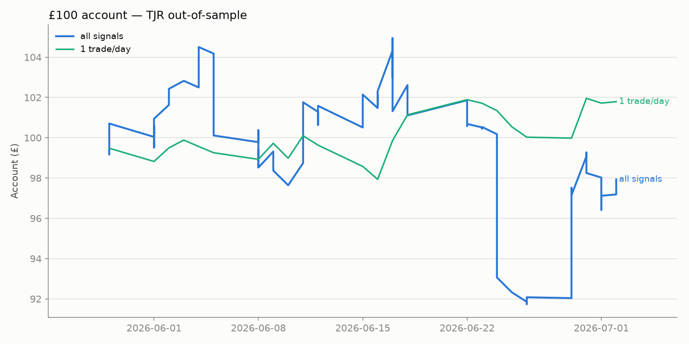
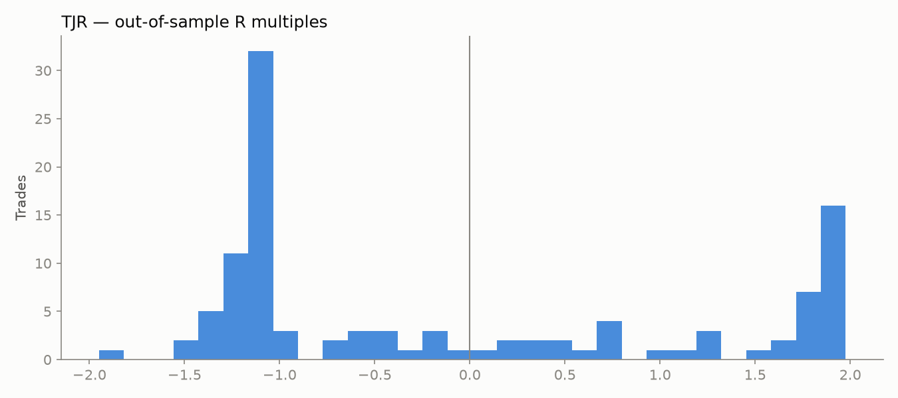

# TJR Strategy Backtest — Liquidity Sweep → MSS → FVG Retrace

Generated 2026-07-04 11:15 UTC.

Mechanical implementation of TJR's published playbook (see `signals_bot/tjr.py` for the exact rules): sweep of prior-day or opening-range liquidity, close back through the level, market structure shift, limit entry on the fair-value-gap retrace, stop at the swept extreme, **2:1 target**, flat by 15:55 ET, one trade per symbol per day, NY-morning entries only.

Universe: **59 symbols**, 5m bars, 60 sessions (2026-04-08 → 2026-07-02), train/test split at **2026-05-29**, 6 bps round-trip costs, conservative fills (stop before target inside a bar).

**Important honesty note:** TJR trades this pattern with discretion — skipping setups, reading context, managing winners. A mechanical scan measures the pattern's raw edge, not the trader's. Results below are what the RULES earn, unaided.

**Research output, not financial advice.**

## All configurations — training period

| config | n trades | win rate | target rate | stop rate | eod rate | expectancy r | profit factor | avg risk pct | trades per day |
|---|---|---|---|---|---|---|---|---|---|
| {'liq': 'both', 'window_end': '11:30', 'fvg_entry': 'edge', 'allow_short': False} | 153 | 38.6% | 25.5% | 49.7% | 24.8% | -0.10 | 0.84 | 0.7% | 4.50 |
| {'liq': 'prevday', 'window_end': '11:30', 'fvg_entry': 'edge', 'allow_short': True} | 87 | 36.8% | 23.0% | 50.6% | 26.4% | -0.15 | 0.77 | 0.6% | 2.72 |
| {'liq': 'prevday', 'window_end': '11:30', 'fvg_entry': 'edge', 'allow_short': False} | 36 | 36.1% | 22.2% | 47.2% | 30.6% | -0.16 | 0.75 | 0.6% | 1.64 |
| {'liq': 'both', 'window_end': '11:30', 'fvg_entry': 'edge', 'allow_short': True} | 315 | 36.5% | 23.8% | 52.7% | 23.5% | -0.16 | 0.75 | 0.6% | 9.00 |
| {'liq': 'both', 'window_end': '11:30', 'fvg_entry': 'mid', 'allow_short': False} | 138 | 33.3% | 20.3% | 53.6% | 26.1% | -0.27 | 0.63 | 0.6% | 4.18 |
| {'liq': 'both', 'window_end': '11:30', 'fvg_entry': 'mid', 'allow_short': True} | 288 | 34.0% | 20.8% | 56.6% | 22.6% | -0.29 | 0.61 | 0.5% | 8.23 |
| {'liq': 'prevday', 'window_end': '11:30', 'fvg_entry': 'mid', 'allow_short': True} | 79 | 32.9% | 20.3% | 55.7% | 24.1% | -0.32 | 0.58 | 0.5% | 2.63 |
| {'liq': 'prevday', 'window_end': '14:00', 'fvg_entry': 'edge', 'allow_short': False} | 135 | 34.1% | 21.5% | 53.3% | 25.2% | -0.33 | 0.57 | 0.5% | 3.86 |
| {'liq': 'both', 'window_end': '14:00', 'fvg_entry': 'edge', 'allow_short': False} | 398 | 33.7% | 20.6% | 53.3% | 26.1% | -0.34 | 0.56 | 0.6% | 11.37 |
| {'liq': 'both', 'window_end': '14:00', 'fvg_entry': 'mid', 'allow_short': False} | 370 | 32.7% | 19.5% | 54.1% | 26.5% | -0.36 | 0.54 | 0.5% | 10.57 |
| {'liq': 'prevday', 'window_end': '14:00', 'fvg_entry': 'edge', 'allow_short': True} | 282 | 34.0% | 21.6% | 55.3% | 23.0% | -0.38 | 0.54 | 0.5% | 8.06 |
| {'liq': 'prevday', 'window_end': '14:00', 'fvg_entry': 'mid', 'allow_short': False} | 124 | 33.1% | 21.0% | 55.6% | 23.4% | -0.40 | 0.52 | 0.4% | 3.54 |
| {'liq': 'prevday', 'window_end': '14:00', 'fvg_entry': 'mid', 'allow_short': True} | 258 | 31.4% | 19.8% | 59.7% | 20.5% | -0.43 | 0.49 | 0.4% | 7.37 |
| {'liq': 'both', 'window_end': '14:00', 'fvg_entry': 'edge', 'allow_short': True} | 746 | 33.2% | 19.6% | 55.8% | 24.7% | -0.45 | 0.48 | 0.6% | 21.31 |
| {'liq': 'prevday', 'window_end': '11:30', 'fvg_entry': 'mid', 'allow_short': False} | 32 | 28.1% | 15.6% | 53.1% | 31.2% | -0.46 | 0.43 | 0.6% | 1.60 |
| {'liq': 'both', 'window_end': '14:00', 'fvg_entry': 'mid', 'allow_short': True} | 698 | 32.2% | 18.8% | 58.0% | 23.2% | -0.47 | 0.46 | 0.5% | 19.94 |

## All configurations — out-of-sample

| config | n trades | win rate | target rate | stop rate | eod rate | expectancy r | profit factor | avg risk pct | trades per day |
|---|---|---|---|---|---|---|---|---|---|
| {'liq': 'prevday', 'window_end': '11:30', 'fvg_entry': 'edge', 'allow_short': True} | 58 | 41.4% | 25.9% | 48.3% | 25.9% | -0.03 | 0.95 | 0.7% | 2.52 |
| {'liq': 'prevday', 'window_end': '11:30', 'fvg_entry': 'edge', 'allow_short': False} | 36 | 41.7% | 25.0% | 47.2% | 27.8% | -0.06 | 0.90 | 0.7% | 2.00 |
| {'liq': 'both', 'window_end': '11:30', 'fvg_entry': 'edge', 'allow_short': False} | 110 | 39.1% | 24.5% | 49.1% | 26.4% | -0.09 | 0.86 | 0.8% | 4.58 |
| {'liq': 'prevday', 'window_end': '11:30', 'fvg_entry': 'mid', 'allow_short': True} | 54 | 38.9% | 25.9% | 53.7% | 20.4% | -0.12 | 0.83 | 0.6% | 2.35 |
| {'liq': 'both', 'window_end': '11:30', 'fvg_entry': 'edge', 'allow_short': True} | 212 | 40.1% | 24.5% | 51.4% | 24.1% | -0.12 | 0.82 | 0.8% | 8.83 |
| {'liq': 'both', 'window_end': '11:30', 'fvg_entry': 'mid', 'allow_short': True} | 196 | 37.2% | 24.0% | 55.1% | 20.9% | -0.14 | 0.80 | 0.7% | 8.17 |
| {'liq': 'prevday', 'window_end': '11:30', 'fvg_entry': 'mid', 'allow_short': False} | 33 | 39.4% | 27.3% | 54.5% | 18.2% | -0.15 | 0.78 | 0.6% | 1.94 |
| {'liq': 'prevday', 'window_end': '14:00', 'fvg_entry': 'edge', 'allow_short': False} | 101 | 38.6% | 22.8% | 53.5% | 23.8% | -0.18 | 0.73 | 0.7% | 4.39 |
| {'liq': 'both', 'window_end': '11:30', 'fvg_entry': 'mid', 'allow_short': False} | 101 | 34.7% | 21.8% | 55.4% | 22.8% | -0.25 | 0.65 | 0.7% | 4.39 |
| {'liq': 'prevday', 'window_end': '14:00', 'fvg_entry': 'edge', 'allow_short': True} | 176 | 36.9% | 24.4% | 55.1% | 20.5% | -0.27 | 0.64 | 0.6% | 7.33 |
| {'liq': 'both', 'window_end': '14:00', 'fvg_entry': 'edge', 'allow_short': False} | 262 | 33.2% | 19.8% | 56.9% | 23.3% | -0.30 | 0.59 | 0.7% | 10.92 |
| {'liq': 'both', 'window_end': '14:00', 'fvg_entry': 'edge', 'allow_short': True} | 484 | 34.5% | 20.0% | 56.0% | 24.0% | -0.31 | 0.59 | 0.7% | 20.17 |
| {'liq': 'prevday', 'window_end': '14:00', 'fvg_entry': 'mid', 'allow_short': False} | 91 | 34.1% | 22.0% | 59.3% | 18.7% | -0.32 | 0.58 | 0.6% | 3.96 |
| {'liq': 'both', 'window_end': '14:00', 'fvg_entry': 'mid', 'allow_short': True} | 453 | 32.9% | 20.3% | 58.5% | 21.2% | -0.38 | 0.54 | 0.6% | 18.88 |
| {'liq': 'both', 'window_end': '14:00', 'fvg_entry': 'mid', 'allow_short': False} | 246 | 32.1% | 20.7% | 58.9% | 20.3% | -0.40 | 0.52 | 0.6% | 10.25 |
| {'liq': 'prevday', 'window_end': '14:00', 'fvg_entry': 'mid', 'allow_short': True} | 160 | 31.9% | 21.9% | 60.6% | 17.5% | -0.47 | 0.47 | 0.5% | 6.67 |

## Train-best configuration: `{'liq': 'both', 'window_end': '11:30', 'fvg_entry': 'edge', 'allow_short': False}`

- Train: 153 trades, win rate 38.6%, expectancy -0.10R.
- **Out-of-sample: 110 trades, win rate 39.1%, expectancy **-0.09R**, profit factor 0.86, outcomes: 25% target / 49% stop / 26% EOD.**

### £100 account, out-of-sample (risking 1% per trade, no leverage)

- Taking **every** signal (110 trades): £100.00 → **£97.93** (-2.1%)
- **First signal each day** (single-position account): £100.00 → **£101.79** (+1.8%)

## Verdict

**No configuration held ≥40% win rate with positive expectancy out-of-sample.** As a mechanical system on this sample, the pattern does not show a tradeable edge after costs. The signal scanner still reports setups for paper-trading/study, but do not fund this with real money on this evidence.