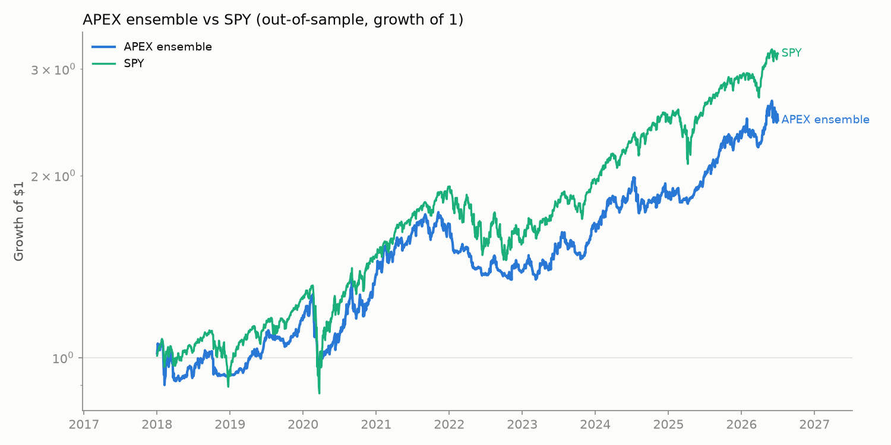
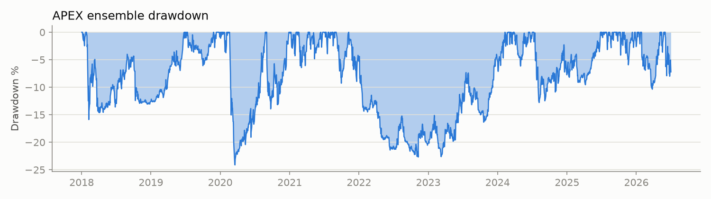

# Grand Tournament — Every Method vs All Data, Ranked by Weekly Profit

Generated 2026-07-04 11:31 UTC. All strategy numbers are **out-of-sample** (walk-forward for swing, 2018+ for rotation, test split for intraday). Costs included. Not tested for lack of data: options, fundamentals/news, order-flow, HFT, futures carry.

**Research output, not financial advice.**

## Leaderboard (top 40 of 187 strategy-asset combinations)

| # | Component | avg week | median week | pct pos weeks | worst week | best week | n weeks | cagr | max dd |
|---|---|---|---|---|---|---|---|---|---|
| 1 | `intraday:ORB (only 6 wks!)` | +1.60% | +1.14% | 50.0% | -5.28% | +10.35% | 6 | — | — |
| 2 | `buy&hold:BTC` | +1.22% | +0.66% | 54.3% | -39.01% | +50.97% | 617 | 33.3% | -83.4% |
| 3 | `swing:ma_cross:BTC` | +1.03% | +0.00% | 36.6% | -24.98% | +50.97% | 473 | 30.8% | -67.2% |
| 4 | `buy&hold:TQQQ` | +1.01% | +1.27% | 57.9% | -37.53% | +28.91% | 856 | 43.2% | -81.7% |
| 5 | `swing:donchian_breakout:BTC` | +0.96% | +0.00% | 25.6% | -17.08% | +50.97% | 473 | 31.5% | -49.5% |
| 6 | `buy&hold:TSLA` | +0.95% | +0.55% | 54.1% | -25.86% | +40.71% | 836 | 41.2% | -73.6% |
| 7 | `buy&hold:NVDA` | +0.93% | +0.59% | 53.7% | -38.85% | +100.43% | 1433 | 36.7% | -89.7% |
| 8 | `swing:tsmom:BTC` | +0.89% | +0.00% | 32.3% | -23.16% | +50.97% | 473 | 26.5% | -67.4% |
| 9 | `buy&hold:UPRO` | +0.78% | +1.04% | 57.8% | -43.88% | +38.44% | 889 | 32.8% | -76.8% |
| 10 | `swing:macd_momentum:BTC` | +0.77% | +0.00% | 34.9% | -16.93% | +50.97% | 473 | 21.4% | -59.7% |
| 11 | `swing:high_52w:BTC` | +0.63% | +0.00% | 15.6% | -18.25% | +50.97% | 473 | 20.8% | -51.4% |
| 12 | `swing:macd_momentum:TQQQ` | +0.57% | +0.00% | 40.6% | -16.85% | +28.88% | 647 | 25.6% | -71.9% |
| 13 | `swing:tsmom:NVDA` | +0.57% | +0.00% | 39.8% | -21.46% | +34.40% | 1223 | 26.2% | -60.2% |
| 14 | `swing:ma_cross:TSLA` | +0.56% | +0.00% | 34.8% | -25.86% | +33.34% | 627 | 22.7% | -69.8% |
| 15 | `swing:donchian_breakout:NVDA` | +0.54% | +0.00% | 32.9% | -18.77% | +34.27% | 1223 | 25.6% | -69.2% |
| 16 | `swing:ma_cross:TQQQ` | +0.53% | +0.00% | 42.7% | -20.72% | +21.06% | 647 | 22.2% | -57.8% |
| 17 | `swing:high_52w:TSLA` | +0.50% | +0.00% | 13.6% | -16.33% | +27.80% | 627 | 31.5% | -26.0% |
| 18 | `rotation:aggressive 63/top2` | +0.50% | +0.20% | 52.5% | -25.32% | +19.99% | 444 | 21.0% | -54.3% |
| 19 | `swing:ma_cross:NVDA` | +0.48% | +0.00% | 42.2% | -22.91% | +34.40% | 1223 | 19.2% | -65.0% |
| 20 | `swing:tsmom:TSLA` | +0.45% | +0.00% | 32.2% | -24.71% | +32.02% | 627 | 16.2% | -54.1% |
| 21 | `swing:macd_momentum:TSLA` | +0.41% | +0.00% | 33.2% | -16.33% | +33.34% | 627 | 14.1% | -66.6% |
| 22 | `buy&hold:SSO` | +0.40% | +0.66% | 57.3% | -34.05% | +25.41% | 1046 | 15.7% | -84.7% |
| 23 | `swing:tsmom:TQQQ` | +0.40% | +0.00% | 43.0% | -27.49% | +31.25% | 647 | 12.6% | -75.0% |
| 24 | `swing:ma_cross:UPRO` | +0.36% | +0.00% | 44.3% | -18.24% | +17.40% | 680 | 15.5% | -58.3% |
| 25 | `swing:donchian_breakout:TQQQ` | +0.33% | +0.00% | 34.6% | -18.76% | +21.16% | 647 | 12.2% | -63.6% |
| 26 | `swing:macd_momentum:UPRO` | +0.33% | +0.00% | 36.9% | -17.77% | +38.44% | 680 | 13.7% | -46.0% |
| 27 | `swing:turn_of_month:UPRO` | +0.31% | +0.00% | 31.9% | -22.91% | +22.94% | 680 | 13.2% | -36.7% |
| 28 | `swing:donchian_breakout:TSLA` | +0.31% | +0.00% | 19.5% | -21.14% | +27.80% | 627 | 12.0% | -45.8% |
| 29 | `swing:macd_momentum:NVDA` | +0.29% | +0.00% | 35.0% | -38.85% | +34.40% | 1223 | 8.6% | -79.0% |
| 30 | `swing:tsmom:UPRO` | +0.26% | +0.00% | 43.1% | -17.14% | +15.27% | 680 | 8.8% | -48.7% |
| 31 | `buy&hold:QQQ` | +0.25% | +0.41% | 56.1% | -24.62% | +20.42% | 1426 | 10.8% | -83.0% |
| 32 | `swing:turn_of_month:NVDA` | +0.25% | +0.00% | 29.0% | -21.40% | +23.02% | 1223 | 10.4% | -51.0% |
| 33 | `swing:rsi_reversion:TQQQ` | +0.25% | +0.00% | 19.6% | -20.39% | +19.15% | 647 | 10.4% | -48.0% |
| 34 | `swing:turn_of_month:BTC` | +0.24% | +0.00% | 24.9% | -22.89% | +22.20% | 473 | 5.7% | -56.8% |
| 35 | `swing:high_52w:NVDA` | +0.24% | +0.00% | 17.0% | -17.05% | +25.39% | 1223 | 14.4% | -48.8% |
| 36 | `buy&hold:EEM` | +0.24% | +0.32% | 55.4% | -20.08% | +28.30% | 1212 | 10.0% | -66.4% |
| 37 | `buy&hold:SLV` | +0.23% | +0.19% | 52.2% | -26.45% | +17.77% | 1054 | 7.1% | -76.3% |
| 38 | `swing:ma_cross:SLV` | +0.23% | +0.00% | 35.6% | -26.45% | +17.77% | 845 | 9.4% | -48.1% |
| 39 | `buy&hold:GOLD` | +0.23% | +0.34% | 56.9% | -9.64% | +13.19% | 1349 | 11.2% | -44.4% |
| 40 | `buy&hold:SPY` | +0.22% | +0.35% | 57.0% | -19.79% | +13.29% | 1745 | 10.8% | -55.2% |

### Bottom 10

| # | Component | avg week | median week | pct pos weeks | worst week | best week | n weeks | cagr | max dd |
|---|---|---|---|---|---|---|---|---|---|
| 178 | `swing:macd_momentum:EFA` | -0.03% | +0.00% | 33.0% | -15.22% | +9.17% | 1088 | -2.2% | -70.3% |
| 179 | `swing:donchian_breakout:TLT` | -0.03% | +0.00% | 25.7% | -7.69% | +8.80% | 1040 | -2.3% | -51.7% |
| 180 | `swing:turn_of_month:SLV` | -0.03% | +0.00% | 24.4% | -28.63% | +10.71% | 845 | -3.5% | -61.1% |
| 181 | `swing:macd_momentum:EEM` | -0.04% | +0.00% | 32.0% | -11.94% | +12.42% | 1003 | -3.1% | -57.4% |
| 182 | `swing:double_low:TSLA` | -0.05% | +0.00% | 19.0% | -22.39% | +17.91% | 627 | -6.4% | -68.3% |
| 183 | `swing:double_low:SLV` | -0.05% | +0.00% | 14.3% | -19.58% | +9.90% | 845 | -3.7% | -53.6% |
| 184 | `swing:tsmom:DBC` | -0.07% | +0.00% | 38.6% | -9.96% | +15.08% | 856 | -4.5% | -70.2% |
| 185 | `swing:rsi_reversion:TSLA` | -0.09% | +0.00% | 11.0% | -22.30% | +12.47% | 627 | -6.3% | -65.1% |
| 186 | `intraday:TJR (only 6 wks!)` | -0.11% | +0.96% | 66.7% | -10.95% | +7.98% | 6 | — | — |
| 187 | `swing:high_52w:DBC` | -0.20% | +0.00% | 28.7% | -10.15% | +3.91% | 157 | -10.7% | -38.0% |

## APEX ensemble — the bot built from the winners

Qualification: ≥150 OOS weeks, positive average week, ≥45% positive weeks, one component per asset. Equal weight across 5 components:

| Component | avg week | median week | pct pos weeks | worst week | best week | n weeks | cagr | max dd |
|---|---|---|---|---|---|---|---|---|
| rotation:aggressive 63/top2 | +0.50% | +0.20% | 52.5% | -25.32% | +19.99% | 444 | 21.0% | -54.3% |
| swing:ma_cross:SSO | +0.20% | +0.00% | 46.4% | -21.10% | +15.06% | 837 | 7.9% | -51.3% |
| rotation:core blend/top3 | +0.19% | +0.31% | 57.0% | -12.25% | +8.46% | 444 | 9.1% | -23.5% |
| swing:tsmom:QQQ | +0.17% | +0.00% | 46.1% | -14.84% | +7.56% | 1217 | 7.8% | -36.0% |
| swing:tsmom:SHY | +0.02% | +0.00% | 47.1% | -0.94% | +1.20% | 1040 | 1.1% | -7.9% |
| **APEX (equal-weight ensemble)** | +0.23% | +0.28% | 57.2% | -12.78% | +6.88% | 444 | 11.2% | -24.1% |

Ensemble window: 2018-01-02 → 2026-07-02. Diversification does the work: the ensemble's worst week and drawdown are far shallower than its components'.

